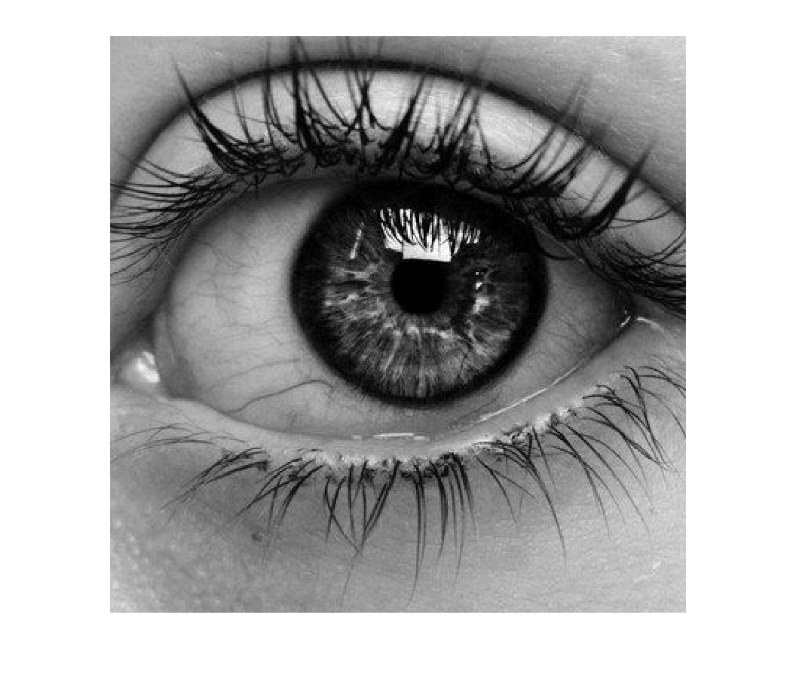
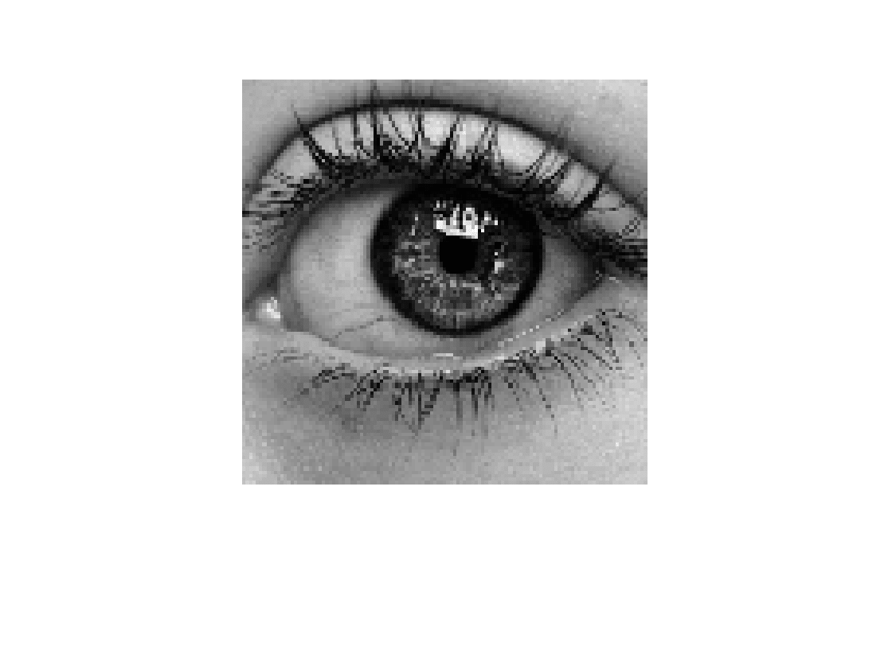
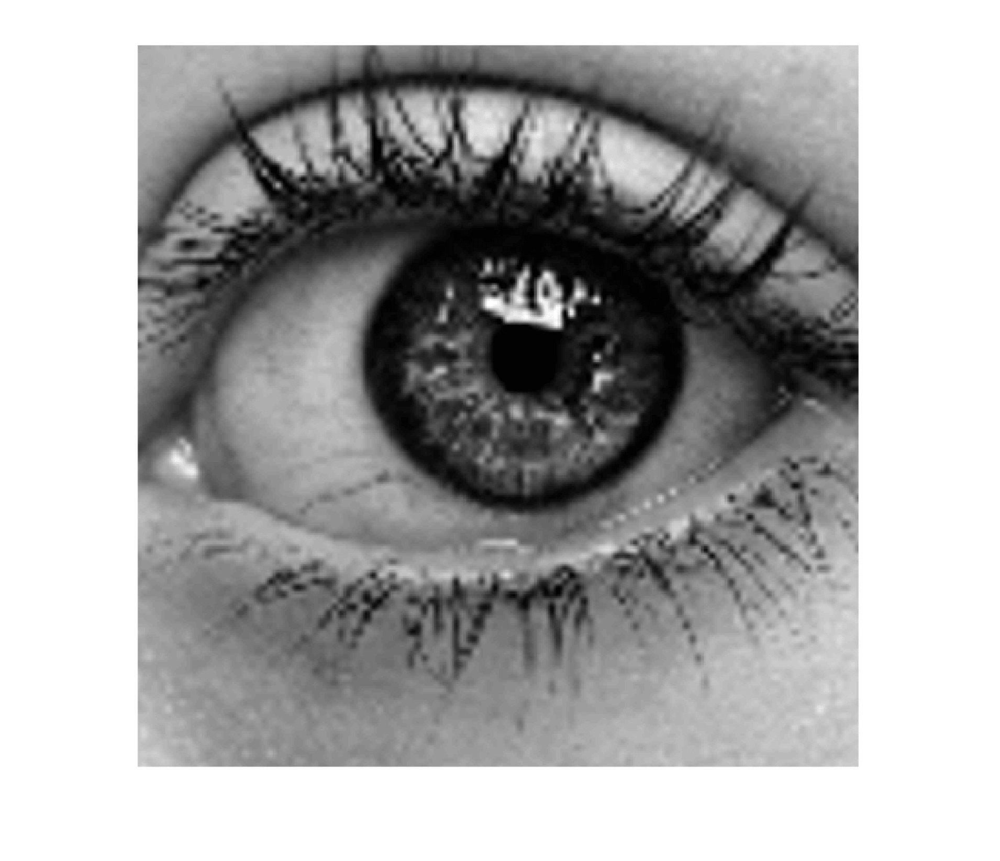
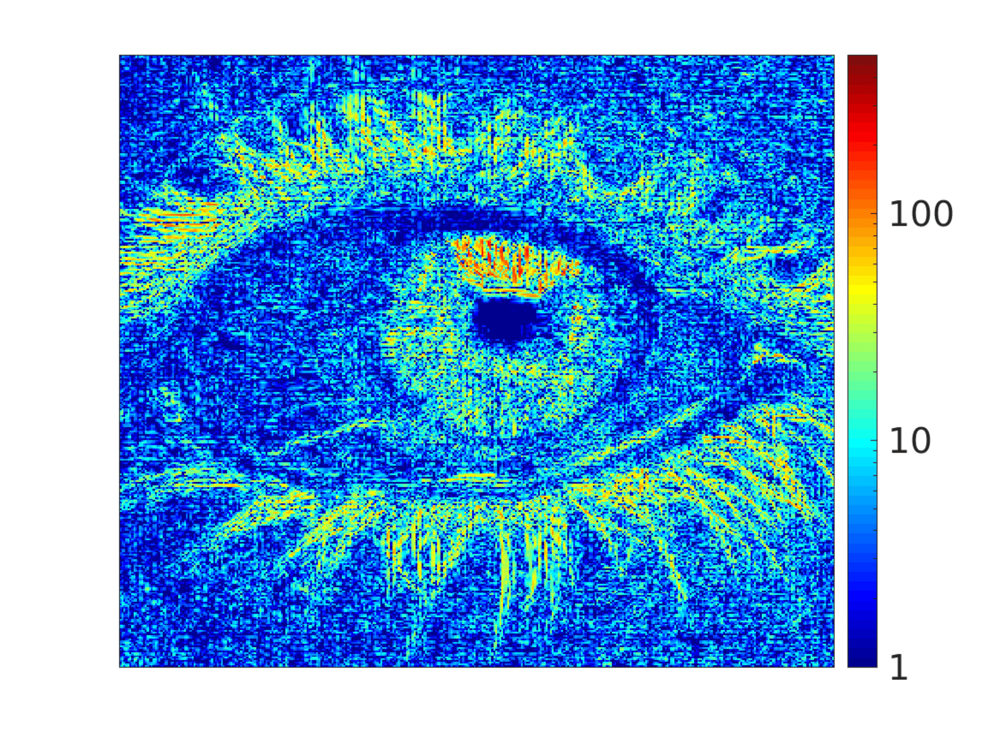
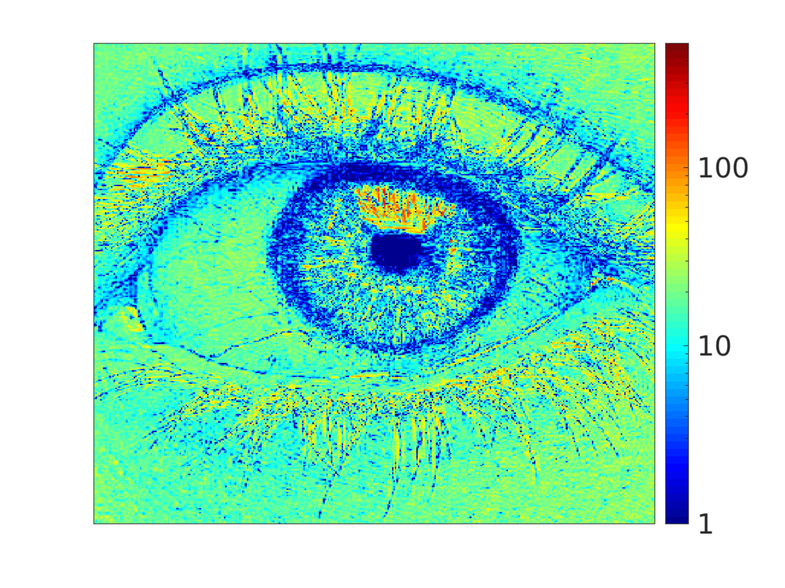
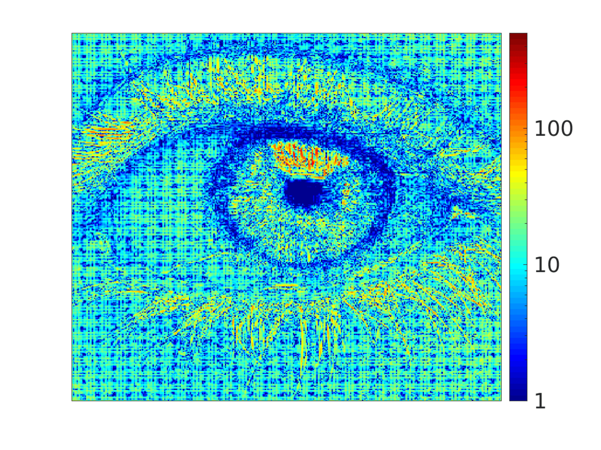
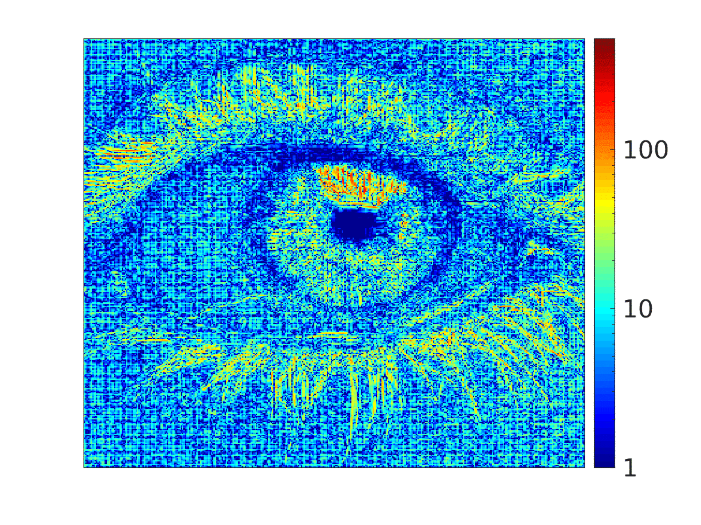

# Interpolation
In this repository, we provide hardware implementations of a set of algorithms proposed as alternatives to bi-cubic interpolation. The architecture of each algorithm is detailed in [1]. 

If you find these implementations useful, please cite the reference [1]. Also, make sure to adhere to the licensing terms of the authors.
## Results 
The obtained results of down-scaling then up-scaling a reference image by a factor of 3.25 using the proposed algorithms in [1]

|Reference image  |   |Down-scaled image   |   |
|:----------:|:---------------------------------------------:|:----------:|:---------------------------------------------:|
|Up-scaled image (bi-cubic)   |  |Error (Bi-cubic), PSNR = 24.057  |   |
|Error (2-piecewise), PSNR = 21.426  |   |Error (4-piecewise), PSNR = 22.501  |   |
|Error (6-piecewise), PSNR = 23.533  |   | Error (Cubic-4linear), PSNR = 24.284  |   |
|Error (2cubic-linear), PSNR = 24.295  |   | Error (3cubic-2linear, PSNR = 24.055  |   |
|Error (3cubic-2modified-linear), PSNR = 24.055  |   |

## Reference 
[1] S. Boukhtache, B. Blaysat, M. Grédiac, and F. Berry. *"Alternatives to bi-cubic interpolation considering FPGA hardware resource consumption"*, *IEEE Transactions on VLSI Systems*, 2020. 
